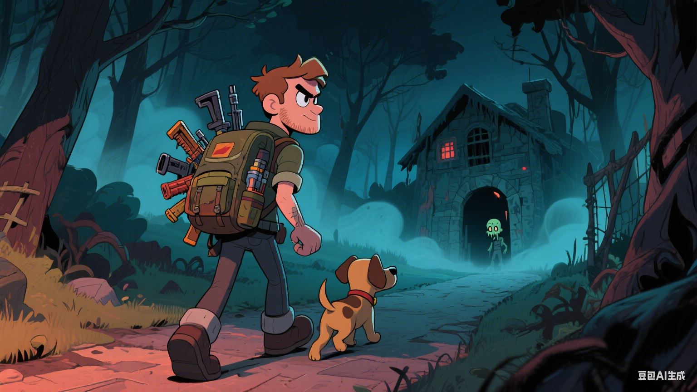

# 植物大战僵尸：戴夫的复仇之旅

## 📖 故事简介

这是一个充满冒险、友谊和勇气的奇幻故事。疯狂发明家戴夫和他忠诚的小狗巴迪踏上了一段惊心动魄的复仇之旅。当神秘的僵尸大王向戴夫发出烹饪比赛邀请时，戴夫意识到背后隐藏着巨大的阴谋。

在这个充满奇幻色彩的世界里，戴夫运用他独特的植物武器和巴迪的聪明才智，穿越危险的沼泽、神秘的迷宫花园和诡异的游乐场，最终深入僵尸大王的厨房要塞。一路上，他们遇到了各种奇特的僵尸敌人，也结交了许多植物盟友。

这不仅是一个关于勇气与智慧的冒险故事，更是一个关于友谊、环保和正义的温馨故事。适合5-12岁儿童阅读，强调幽默、冒险和积极价值观。

## 🎬 故事预览

<video src="https://github.com/user-attachments/assets/5b7b06f2-f5ce-40b8-9240-243f0771e141" controls="controls" muted="muted" class="d-block rounded-bottom-2 border-top width-fit" style="max-height:640px; min-height: 200px">
</video>

## 📚 章节目录

### 第一部分：出发与冒险（第1-5章）
1. [出发与空中威胁](chapters/01-出发与空中威胁.md) - 戴夫和巴迪出发，遭遇僵尸蝙蝠，使用豌豆射手逃脱
2. [沼泽奇遇](chapters/02-沼泽奇遇.md) - 穿越沼泽，与跳跃青蛙和蜜蜂战斗，巴迪救援
3. [迷宫花园](chapters/03-迷宫花园.md) - 移动的向日葵迷宫，谜题逃脱
4. [游乐场混战](chapters/04-游乐场混战.md) - 小丑僵尸游戏，樱桃炸弹反击
5. [水上冒险](chapters/05-水上冒险.md) - 海盗僵尸船战，到达厨房大门

### 第二部分：深入厨房（第6-15章）
6. [厨房入口谜题](chapters/06-厨房入口谜题.md) - 解决僵尸谜语，进入前厅
7. [调味陷阱](chapters/07-调味陷阱.md) - 胡椒和盐僵尸，冰射手应对
8. [蔬菜大战](chapters/08-蔬菜大战.md) - 胡萝卜地下攻击，植物军团加入
9. [冰箱寒界](chapters/09-冰箱寒界.md) - 冰僵尸，火焰胡椒融化冰层
10. [烤箱火焰](chapters/10-烤箱火焰.md) - 熔岩挑战，水生植物灭火
11. [配方室秘密](chapters/11-配方室秘密.md) - 药水变身，获得新武器
12. [宴会大厅](chapters/12-宴会大厅.md) - 跳舞僵尸派对，音乐植物干扰
13. [地下仓库](chapters/13-地下仓库.md) - 箱子伪装，寻宝历史
14. [电梯惊魂](chapters/14-电梯惊魂.md) - 坠落陷阱，坚果缓冲
15. [实验室破坏](chapters/15-实验室破坏.md) - 科学僵尸，释放友好植物

### 第三部分：终极对决（第16-18章）
16. [大王苏醒](chapters/16-大王苏醒.md) - 揭露宿敌，玉米炮斗争
17. [全面对决](chapters/17-全面对决.md) - 植物大战僵尸终极战役
18. [爆炸高潮](chapters/18-爆炸高潮.md) - 厨房坍塌，反击决议

### 第四部分：胜利与重生（第19-20章）
19. [胜利反思](chapters/19-胜利反思.md) - 拯救一些僵尸，将它们转化为盟友
20. [回家新始](chapters/20-回家新始.md) - 重建农场，永恒友谊

## 🌟 核心主题

- **友谊** - 戴夫和巴迪之间的深厚友谊，以及与植物盟友的团结
- **勇气** - 面对各种奇怪僵尸和未知挑战时展现的勇敢精神
- **环境保护** - 植物保护家园，维护自然平衡
- **正义** - 最终化敌为友，用爱与理解战胜仇恨

## 👥 主要角色

### 英雄角色
- **戴夫** - 疯狂发明家，勇敢而有趣，善于使用各种植物武器
- **巴迪** - 忠诚的狗，聪明敏捷，在关键时刻提供幽默和重要帮助
- **植物盟友** - 豌豆射手、樱桃炸弹、向日葵等拟人化植物角色

### 反派角色
- **僵尸大王** - 最终Boss，隐藏着复杂的过去和动机
- **各种变异僵尸** - 飞行蝙蝠、歌唱花朵、小丑僵尸等，各具独特个性

## 📖 阅读指南

这个故事由20个章节组成，每章约1500字，专为5-12岁儿童设计。我们建议按章节顺序阅读，因为每个章节都有独立的冒险情节，同时与整体故事情节紧密相连。

每章结尾都有导航链接，方便在章节间跳转。

---

*一个关于友谊、勇气和成长的奇幻冒险故事。让我们一起跟随戴夫和巴迪踏上这段难忘的旅程！*